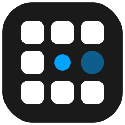

<p align="center">
  
</p>

# Link2Chrome

Link2Chrome 是一个本地优先的浏览器自动化项目，通过 Chrome 扩展、WebSocket 和 MCP Server 将 Claude Code 与当前 Chrome 浏览器连接起来，让本地 Agent 可以读取页面状态、执行点击输入、滚动、标签页管理和基于视觉的页面操作。

## 功能概览

- 本地 MCP Server：通过 stdio 向 Claude Code 暴露浏览器工具。
- Chrome 扩展：基于 Manifest V3，通过 `chrome.debugger` 调用 Chrome DevTools Protocol。
- WebSocket 桥接：Server 与扩展之间通过本地 WebSocket 通信。
- 页面观察：支持 URL、标题、截图、压缩 DOM、正文提取等状态获取。
- 浏览器操作：支持导航、点击、输入、滚动、拖拽、等待、标签页管理等动作。
- 视觉交互：可调用兼容 OpenAI SDK 的视觉模型，将自然语言目标转换为页面坐标。

## 目录结构

```text
.
├── extension/                  # Chrome 扩展源码
├── server/                     # Python MCP Server
├── docs/                       # 使用说明和阶段文档
├── test/                       # 测试与验证脚本
├── claude_config_snippet.json  # Claude Code MCP 配置示例
├── setup.sh                    # 本地安装脚本
└── server/requirements.txt     # Python 依赖
```

## 环境要求

- Python 3.10+
- Chrome / Chromium
- Claude Code

当前 MCP Python SDK 要求 Python 3.10 或更高版本。如果本机默认 Python 是 3.9，请先安装 `python3.10`、`python3.11` 或 `python3.12`，再由安装脚本创建隔离虚拟环境，避免污染系统环境。

## 快速开始

```bash
./setup.sh
```

安装脚本会创建 `server/venv`，安装服务端依赖，并在缺少 `.env` 时生成配置模板。

手动安装方式：

```bash
python3.10 -m venv server/venv
server/venv/bin/pip install -r server/requirements.txt
```

然后在项目根目录创建 `.env`：

```env
DOUBAO_API_KEY=your-api-key-here
DOUBAO_BASE_URL=https://ark.cn-beijing.volces.com/api/v3
DOUBAO_MODEL=doubao-seed-1.8-thinking-250528
LOG_LEVEL=INFO
```

## 加载 Chrome 扩展

1. 打开 `chrome://extensions/`
2. 开启「开发者模式」
3. 点击「加载已解压的扩展程序」
4. 选择本项目的 `extension/` 目录

## 配置 Claude Code

将 `claude_config_snippet.json` 中的配置合并到 Claude Code 的配置文件中，并根据本机路径调整 `command`、`args` 和 `cwd`。

## 开发与测试

测试文件统一放在 `test/` 目录中。

```bash
server/venv/bin/python -m pytest test
```

## 安全提示

- 不要提交 `.env`、日志、缓存、虚拟环境或运行输出。
- Chrome 扩展使用 `debugger` 权限，请只在可信环境中加载和运行。
- 视觉模型 API Key 仅应通过本地环境变量或 `.env` 提供。

## License

MIT License. See [LICENSE](LICENSE) for details.
